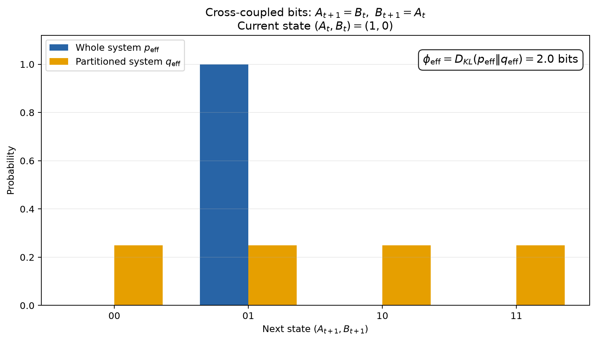

# Introduction_to_Applied_Mathematics_and_Computation_B

**岡 巧人**
oka takuto

## Assignment 3: IITの例 - 交差結合した2ビット系

講義資料にはない例として、互いの値を次の時刻へ渡す2ビット系を扱います。

```text
A(t+1) = B(t)
B(t+1) = A(t)
```

現在状態を `(A(t), B(t)) = (1, 0)` とすると、全体系の次状態は必ず
`(A(t+1), B(t+1)) = (0, 1)` です。したがって、全体系の効果レパートリーは
次状態 `01` に確率1を持ちます。

一方、`A` と `B` の因果的な接続を切り、切断された入力を独立な公平コインで
置き換えると、各ビットの次状態はそれぞれ0と1を確率1/2で取ります。その積分布
では `00`, `01`, `10`, `11` がすべて確率1/4です。

この簡略化した設定で、効果側の統合情報をKLダイバージェンスで測ると、

```text
phi_eff = D_KL(p_eff || q_eff)
        = log2(1 / (1/4))
        = 2 bits
```

となります。つまり、全体系では次状態を一意に指定できるのに、分割するとその
因果的な制約が失われます。この差が、IITにおける「全体へ統合された情報」の
簡単な例です。

### 実行方法

Python 3が必要です。必要なライブラリは `requirements.txt` から導入できます。

```bash
python -m pip install -r requirements.txt
python assignment_3.py
```

実行すると図を画面に表示し、リポジトリ直下へ `assignment_3.png` を保存します。
画面表示が不要な環境では次のように実行できます。

```bash
python assignment_3.py --no-show
```

### 出力例



### 注意

これは講義資料と同じく、IITの考え方を説明するためにKLダイバージェンスを使った
簡略化モデルです。IIT 3.0やIIT 4.0の完全な計算手続きを実装したものではありません。
