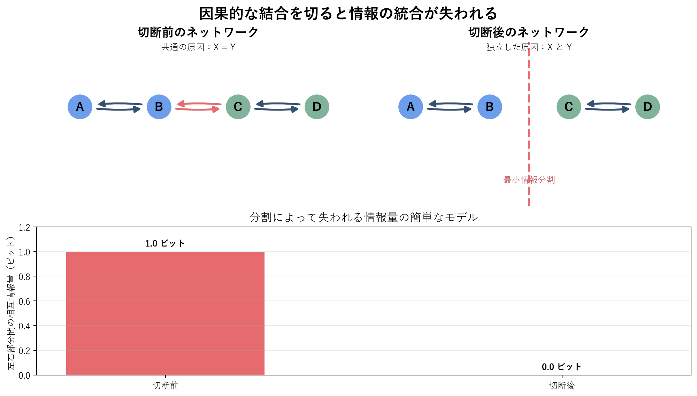

# グラフの切断と統合情報

このフォルダの `plot_graph_cut.py` は、因果ネットワークを二つの部分に切断すると、部分間で共有されていた情報が失われる様子を描きます。これは課題の選択肢 3「グラフを切ることで統合情報が失われる様子」に対応します。

## 図のモデル

ネットワークは左半分 `{A, B}` と右半分 `{C, D}` からなります。

- **切断前**: `B -> C` と `C -> B` が左右を結び、両側は同じ二値変数を共有する玩具モデルです。左右の状態をそれぞれ `X`, `Y` とすると `X = Y` なので、左右間の相互情報量は 1 bit です。
- **切断後**: 中央の二つの有向辺を取り除き、左右を独立な二値変数で駆動します。このとき `X` と `Y` は独立なので、左右間の相互情報量は 0 bit になります。

この比較は、「全体を分割すると失われる因果的・情報的な制約」を視覚化しています。統合情報理論（IIT）では、システムを分割したときに原因・結果の構造がどれだけ変化するかが統合の中心的な考え方です。図の赤い破線は、その変化を調べるための分割を表します。

ここで表示する相互情報量は説明用の簡単な指標であり、IIT 3.0 や IIT 4.0 における正式な統合情報量 `Phi` の計算ではありません。厳密な `Phi` の評価には、状態遷移確率、原因・結果レパートリー、分割前後の区別などを定義する必要があります。

## 実行方法

リポジトリのルートで依存関係を導入し、次のように実行します。

```powershell
python -m pip install -r requirements.txt
python graph_cut_integrated_information/plot_graph_cut.py
```

GUI を使わずに画像だけを生成する場合は、次のように実行します。

```powershell
python graph_cut_integrated_information/plot_graph_cut.py --no-show
```

出力画像は、このフォルダ内の `graph_cut_integrated_information.png` に保存されます。保存先は `--output` オプションで変更できます。

## 出力例


